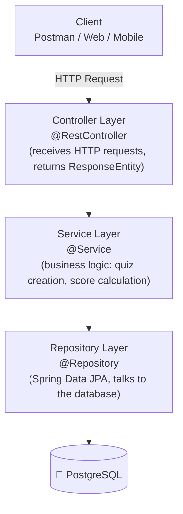
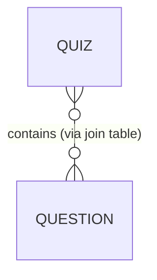

# 🧠 Quiz Application — Monolithic REST API Backend

**Phase 1 of a 2-phase journey:** Build a fully working backend as a **Monolith** first, understand its strengths & pain points, then refactor it into **Microservices**.

`Java 17` · `Spring Boot` · `Spring Data JPA` · `PostgreSQL` · `Maven` · `Postman`

---

## 📖 Table of Contents

1. [Project Overview](#-project-overview)
2. [Background — Why Monolith First?](#-background--why-monolith-first)
3. [Tech Stack](#-tech-stack)
4. [Layered Architecture](#-layered-architecture)
5. [Database Design](#-database-design)
6. [API Reference](#-api-reference)
7. [Status Codes & Exception Handling](#-status-codes--exception-handling-target-6)
8. [Postman Testing](#-postman-testing)
9. [How to Run Locally](#️-how-to-run-locally)
10. [Key Learnings](#-key-learnings)
11. [Roadmap — Phase 2: Microservices](#-roadmap--phase-2-microservices)

---

## 📌 Project Overview

A Quiz Management REST API with two user roles:

| Role | Capabilities |
|------|---------------|
| **Admin** | Add / update / delete questions, create quizzes |
| **User** | Fetch a quiz by ID, submit answers, view final score (via web/mobile client) |

The API is built using a clean layered architecture on top of **PostgreSQL**, with proper HTTP semantics, status codes, and exception handling.

---

## 🎯 Background — Why Monolith First?

> To understand why microservices exist, we first build the thing they replace.

### The Monolithic Approach

Take a large product like Amazon. It has many functional areas:

`Users` · `Sellers` · `Cart` · `Payment` · `Analytics` · `Search` · `Shipping` · `Order Management`

In an organization, separate teams are formed for each of these features — but in a **monolith**, all of that code lives in **one single codebase**, packaged as **one JAR/WAR**, and deployed to **one server**.

#### ✅ Advantages

- Simple to develop and reason about initially
- Single deployment unit — easy to ship
- Easy end-to-end testing and debugging
- Simple monitoring (one application, one log)

#### ❌ Drawbacks

| # | Drawback | Explanation |
|---|----------|--------------|
| 1 | **Team dependencies** | Every team works inside the same package/codebase → merge conflicts, tight coupling, one team's change can break another's |
| 2 | **Scalability** | If only Search and Payment get heavy traffic, we still must scale the *entire* application — wasteful and expensive |
| 3 | **Technology lock-in** | Whole app is stuck on a single stack. We can't write Search in Python, Payment in Node.js, Orders in Java |
| 4 | **Fault propagation** | If one feature crashes, it can take down the whole application |
| 5 | **Slow deployments** | Even a tiny fix requires rebuilding and redeploying everything |

### ☁️ The Microservices Alternative

Split the project into self-contained services — one per feature/team. Each service:

- Can be deployed independently
- Can be scaled independently (scale only Search, not everything)
- Can be built with any technology (Java, Node.js, Python, .NET …)
- Should not depend on other services' internals
- Communicates with other services over HTTP — request/response via endpoints
- Requires explicit handling of security between services

> 🧭 **Strategy of this project:** build the mini app as a monolith first → feel the structure → then break it into microservices in Phase 2.

---

## 🛠 Tech Stack

| Layer | Technology |
|-------|------------|
| Language | Java 17 |
| Framework | Spring Boot (Spring Web, Spring Data JPA) |
| Database | PostgreSQL |
| Build Tool | Maven |
| Testing | Postman |

---

## 🏗 Layered Architecture

Every request flows through clean, separated layers:



**Why layering?** Separation of concerns — the controller never touches SQL, the repository never contains business rules. Each layer is testable and swappable.

---

## 🗄 Database Design

### `question` Table

| Column | Type | Description |
|--------|------|--------------|
| id | INT (PK) | Auto-generated ID |
| question_title | VARCHAR | The question text |
| option1..4 | VARCHAR | Four answer options |
| right_answer | VARCHAR | Correct option |
| difficulty_level | VARCHAR | Easy / Medium / Hard |
| category | VARCHAR | Java / Python / SQL … |

### `quiz` Table

| Column | Type | Description |
|--------|------|--------------|
| id | INT (PK) | Auto-generated ID |
| title | VARCHAR | Quiz title |

### 🔗 Relationship: Many-to-Many

A quiz contains many questions, and the same question can appear in multiple quizzes → this maps to a `@ManyToMany` JPA relationship, implemented via a third join table (`quiz_question`):



Instead of duplicating questions per quiz, the join table keeps the data normalized:

| quiz_id | question_id |
|---------|--------------|
| 1 | 3 |
| 1 | 7 |
| 2 | 3 |

---

## 📡 API Reference

**Base URL:** `http://localhost:8080`

### Question Endpoints

| # | Target | Method | Endpoint | Description |
|---|--------|--------|----------|--------------|
| 1 | TARGET 1 | `GET` | `/question/allQuestions` | Fetch all questions |
| 2 | TARGET 2 | `GET` | `/question/category/{category}` | Fetch questions by category |
| 3 | TARGET 3 | `POST` | `/question/add` | Add a new question |
| 4 | TARGET 4 | `PUT` | `/question/update` | Update an existing question |
| 5 | TARGET 5 | `DELETE` | `/question/delete` | Delete a question |

#### TARGET 1 — Get All Questions

```
GET /question/allQuestions
```

→ `200 OK`

```json
[
  {
    "id": 1,
    "questionTitle": "Which keyword is used to inherit a class in Java?",
    "option1": "implements",
    "option2": "extends",
    "option3": "inherits",
    "option4": "super",
    "rightAnswer": "extends",
    "difficultyLevel": "Easy",
    "category": "Java"
  }
]
```

#### TARGET 2 — Get Questions by Category

```
GET /question/category/Java
```

→ `200 OK` with only questions belonging to that category.

#### TARGET 3 — Add a Question

```
POST /question/add
```

→ `201 Created`

```json
{
  "questionTitle": "What is the default value of a boolean in Java?",
  "option1": "true",
  "option2": "false",
  "option3": "null",
  "option4": "0",
  "rightAnswer": "false",
  "difficultyLevel": "Easy",
  "category": "Java"
}
```

#### TARGET 4 — Update a Question

```
PUT /question/update
```

Same body, with `id` included → `200 OK`

#### TARGET 5 — Delete a Question

```
DELETE /question/delete?id=1
```

→ `200 OK`

### Quiz Endpoints

| # | Target | Method | Endpoint | Description |
|---|--------|--------|----------|--------------|
| 7 | TARGET 7 | `POST` | `/quiz/create?category=Java&noOfQuestions=5&title=JQuiz` | Create a quiz |
| 8 | TARGET 8 | `GET` | `/quiz/get/{id}` | Fetch a quiz by ID |
| 9 | TARGET 9 | `POST` | `/quiz/submit/{id}` | Submit answers & get score |

#### TARGET 7 — Create a Quiz

```
POST /quiz/create?category=Java&noOfQuestions=5&title=JQuiz
```

- Picks N random questions of the given category and difficulty
- Persists the quiz in the database — otherwise the quiz would be lost when the user comes back tomorrow (persistence matters!)

→ `201 Created`: `"success"`

#### TARGET 8 — Fetch a Quiz (for the user)

```
GET /quiz/get/1
```

⚠️ **Important design decision:** the quiz is returned through a wrapper/DTO that **excludes `rightAnswer`** — otherwise the user could inspect the network response and cheat.

```json
[
  {
    "id": 1,
    "questionTitle": "Which keyword is used to inherit a class in Java?",
    "option1": "implements",
    "option2": "extends",
    "option3": "inherits",
    "option4": "super"
  }
]
```

#### TARGET 9 — Submit Quiz & Calculate Result

```
POST /quiz/submit/1
```

The user's client sends only question IDs + selected responses:

```json
[
  { "id": 1, "response": "extends" },
  { "id": 2, "response": "false" }
]
```

Server compares responses against `rightAnswer` on the backend and returns the score:

```
3
```

> **Why check answers server-side?** If we sent the correct answers to the client (e.g., to check locally), shuffling/randomizing the option order would break the mapping — and worse, the answers would be exposed to the user. Score calculation belongs to the **Service Layer**, entirely on the server.

---

## 🚦 Status Codes & Exception Handling (TARGET 6)

A good API doesn't just return data — it communicates **what happened** through proper HTTP status codes. All endpoints return `ResponseEntity<T>` for full control over status + body.

| Status Code | Meaning | When it's used here |
|-------------|---------|----------------------|
| `200 OK` | Success | GET / PUT / DELETE succeeded |
| `201 Created` | Resource created | New question / quiz added |
| `400 Bad Request` | Client error | Missing/invalid fields in request body |
| `404 Not Found` | Not found | Category doesn't exist / quiz ID not found |
| `500 Internal Server Error` | Server fault | Unexpected failure on our side |

**Benefits for the client:** a mobile/web client can instantly branch on the status code (show success screen vs. error toast) without parsing fragile response bodies.

---

## 🧪 Postman Testing

All endpoints are verified through a Postman collection mirroring the API:

```
📦 QuizApp Collection
├── 📁 Questions
│   ├── 🟢 GET    allQuestions
│   ├── 🟢 GET    questionCategory
│   ├── 🟡 POST   addQuestion
│   ├── 🔵 PUT    updateQuestion
│   └── 🔴 DELETE deleteQuestion
└── 📁 Quiz
    ├── 🟡 POST   createQuiz        (?category=&noOfQuestions=&title=)
    ├── 🟢 GET    getQuizById       (/quiz/get/1)
    └── 🟡 POST   submitQuiz        (/quiz/submit/1)
```

**Typical test flow:**

1. `addQuestion` × N → seed the database
2. `allQuestions` / `questionCategory` → verify data
3. `createQuiz` → build a quiz from existing questions
4. `getQuizById` → confirm no `rightAnswer` leaks
5. `submitQuiz` → verify the score matches expected correct answers

---

## ⚙️ How to Run Locally

### Prerequisites

- Java 17+
- Maven
- PostgreSQL

### Steps

1. **Create the database** (if not using auto-creation):

   ```sql
   CREATE DATABASE quizapp;
   ```

2. **Configure** `src/main/resources/application.properties`:

   ```properties
   spring.datasource.url=jdbc:postgresql://localhost:5432/quizapp
   spring.datasource.username=postgres
   spring.datasource.password=your_password
   spring.jpa.hibernate.ddl-auto=update
   spring.jpa.show-sql=true
   ```

3. **Run the app:**

   ```bash
   mvn spring-boot:run
   ```

4. **Test with Postman** at `http://localhost:8080` 🎉

---

## 🎓 Key Learnings

- ✅ Why monoliths hurt at scale (team coupling, selective scaling, tech lock-in, fault propagation)
- ✅ Designing REST endpoints with correct HTTP verbs & status codes
- ✅ Layered architecture: Controller → Service → Repository → DB
- ✅ Spring Data JPA & `@ManyToMany` relationships via a join table
- ✅ Using DTOs/wrappers to hide sensitive fields (`rightAnswer`)
- ✅ Server-side score calculation & persistence-first design
- ✅ API testing discipline with Postman

---

## 🔮 Roadmap — Phase 2: Microservices

The monolith works — now it's time to feel its limits and break it apart:

| Step | Plan |
|------|------|
| 1 | Split into **Question Service** and **Quiz Service** (separate apps/DBs) |
| 2 | Inter-service communication — Quiz Service calls Question Service over HTTP (`RestTemplate` / `WebClient` / `OpenFeign`) |
| 3 | **API Gateway** — single entry point for all clients |
| 4 | **Service Discovery** (Eureka) so services find each other dynamically |
| 5 | **Security** — Spring Security / JWT across services |
| 6 | Optionally rebuild one service in a different technology to prove independence |

---

*Built as a hands-on exploration of monolith → microservices architecture.* 🚀
